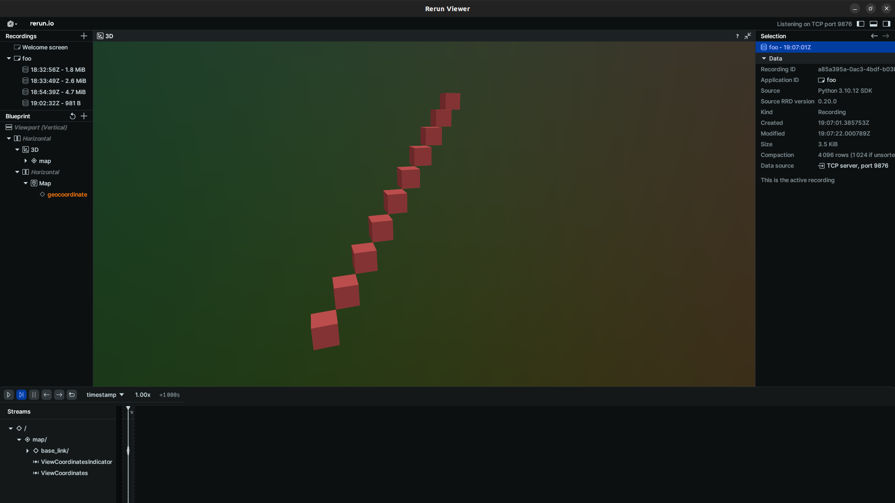
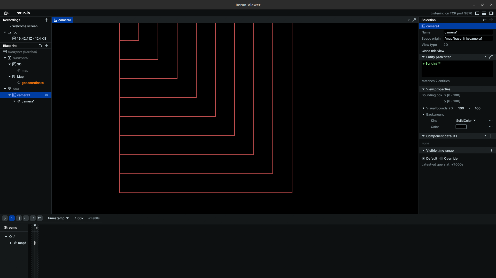
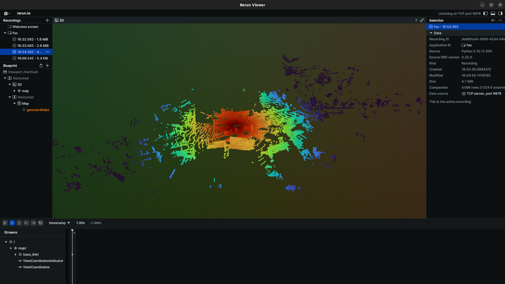
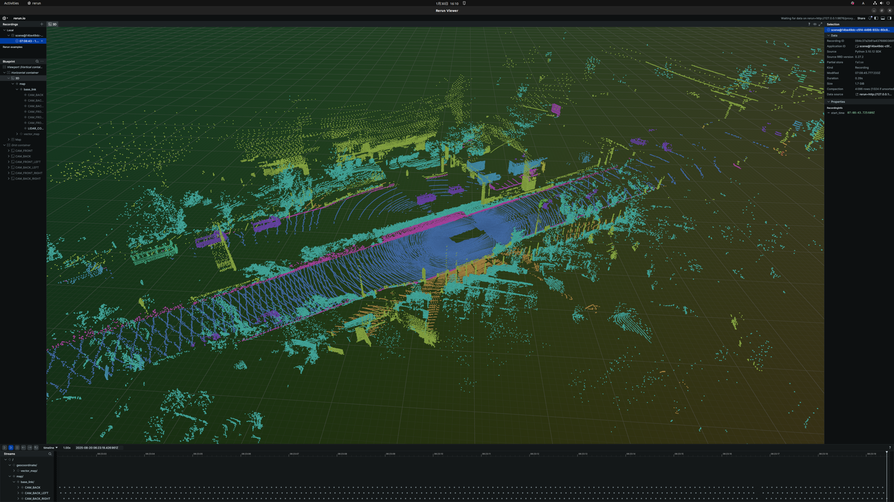
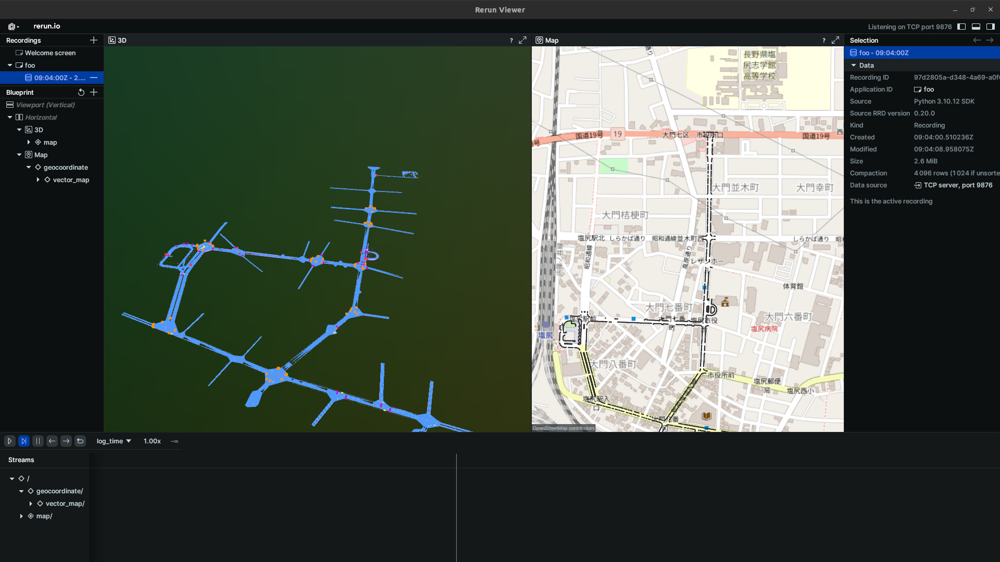

## Rendering with `T4Devkit`

If you want to visualize annotation results, `T4Devkit` supports some rendering methods as below.

### Scene

```python
>>> t4.render_scene()
```


### Specific Instance(s)

```python
>>> instance_token = t4.instance[0].token
>>> t4.render_instance(instance_token)
```


<!-- prettier-ignore-start -->
!!! NOTE
    You can also render multiple instances at once:

    <!-- markdownlint-disable MD046 -->
    ```python
    >>> instance_tokens = [inst.token for inst in t4.instance[:3]]
    >>> t4.render_instance(instance_tokens)
    ```
<!-- prettier-ignore-end -->

### PointCloud

```python
>>> t4.render_pointcloud()
```

If `SampleData.info_filename` points to a pointcloud metainfo JSON file, `T4Devkit.render_pointcloud()` loads it automatically. This allows rendering pointclouds with extended per-point features such as `return_type` or `timestamp`. When no metainfo file is available, the standard 5-feature layout is assumed.


#### Rosbag Support

If the dataset contains an `input_bag/` directory with rosbag2 files (db3 or mcap format), you can read LiDAR point clouds directly from the rosbag instead of the processed `.pcd.bin` files.

Both `sensor_msgs/msg/PointCloud2` and `pandar_msgs/msg/PandarScan` (Hesai raw packet) topics are supported. PandarScan packets are decoded to point clouds using the specified sensor model's elevation angles.

The `topic_mapping` parameter maps T4 dataset sensor channel names (e.g. `LIDAR_TOP`, `LIDAR_CONCAT`) to ROS topic names in the rosbag. This mapping is required so that `get_lidar_pointcloud()` can look up the correct rosbag topic for each `sample_data.channel`.

For `PointCloud2` topics, a simple dict mapping is sufficient:

```python
>>> from t4_devkit import T4Devkit

>>> t4 = T4Devkit(
...     "data/tier4/",
...     use_rosbag=True,
...     topic_mapping={"LIDAR_CONCAT": "/sensing/lidar/concatenated/pointcloud"},
... )
```

For `PandarScan` topics, use `TopicMapping` with `sensor_type` to specify the Hesai sensor model (`"XT32"` or `"OT128"`):

```python
>>> from t4_devkit import T4Devkit
>>> from t4_devkit.rosbag.topic_mapping import TopicMapping

>>> t4 = T4Devkit(
...     "data/tier4/",
...     use_rosbag=True,
...     topic_mapping=[
...         TopicMapping(
...             channel="LIDAR_CONCAT",
...             topic="/sensing/lidar/top/pandar_packets",
...             sensor_type="OT128",
...         ),
...     ],
... )

>>> pc = t4.get_lidar_pointcloud(sample_data_token)
>>> t4.render_pointcloud()
```

If `topic_mapping` is omitted, `PointCloud2` topics are auto-detected from the rosbag. `PandarScan` topics always require explicit `topic_mapping` with `sensor_type`.

### Save Recording

You can save the rendering result as follows:

```python
>>> t4.render_scene(scene_token, save_dir=<DIR_TO_SAVE>)
```

When you specify `save_dir`, viewer will not be spawned on your screen.

## Rendering with `RerunViewer`

If you want to visualize your components, such as boxes that your ML-model estimated, `RerunViewer` allows you to visualize these components.
For details, please refer to the API references.

To initialize `RerunViewer`, you can use the `ViewerBuilder` class:

```python
>>> from t4_devkit.viewer import ViewerBuilder
# You need to specify `cameras` if you want to 2D spaces
>>> viewer = (
        ViewerBuilder()
        .with_spatial3d()
        .with_spatial2d(cameras=["CAM_FRONT", "CAM_BACK"])
        .with_labels({"car": 1, "pedestrian": 2})
        .build(app_id="foo")
    )

# Timestamp in seconds
>>> seconds: int | float = ...
```

### Rendering 3D boxes

```python
# Rendering 3D boxes
>>> from t4_devkit.dataclass import Box3D
>>> box3ds = [Box3D(...)...]
>>> viewer.render_box3ds(seconds, box3ds)
```

It allows you to render boxes by specifying elements of boxes directly.

```python
# Rendering 3D boxes by specifying elements of boxes directly
>>> centers = [[i, i, i] for i in range(10)]
>>> frame_id = "base_link"
>>> rotations = [[1, 0, 0, 0] for _ in range(10)]
>>> sizes = [[1, 1, 1] for _ in range(10)]
>>> class_ids = [0 for _ in range(10)]
>>> viewer.render_box3ds(seconds, frame_id, centers, rotations, sizes, class_ids)
```



### Rendering 2D boxes

For 2D spaces, you need to specify camera names in the viewer constructor, and render images by specifying camera names:

```python
>>> import numpy as np
>>> from t4_devkit.dataclass import Box2D

# Rendering an image
>>> image = np.zeros((100, 100, 3), dtype=np.uint8)
>>> viewer.render_image(seconds, "camera1", image)

# Rendering 2D boxes
>>> box2ds = [Box2D(...)...]
>>> viewer.render_box2ds(seconds, "camera1", box2ds)
```

It allows you to render boxes by specifying elements of boxes directly:

```python
# Rendering 2D boxes by specifying elements of boxes directly
>>> rois = [[0, 0, 10 * i, 10 * i] for i in range(10)]
>>> viewer.render_box2ds(seconds, "camera1", rois, class_ids)
```



### Rendering point cloud

```python
from t4_devkit.dataclass import LidarPointCloud
from t4_devkit.viewer import PointCloudColorMode
# Point cloud channel name
>>> lidar_channel = "LIDAR_TOP"
# Load point cloud from file.
# Pass metainfo_filepath when the binary stores more than 5 float32 values per point.
>>> pointcloud = LidarPointCloud.from_file(
...     <PATH_TO_POINTCLOUD.pcd.bin>,
...     metainfo_filepath=<PATH_TO_POINTCLOUD_INFO.json>,
... )
>>> color_mode = PointCloudColorMode.DISTANCE
>>> viewer.render_pointcloud(seconds, lidar_channel, pointcloud, color_mode)
```



### Rendering LiDAR segmentation

```python
from t4_devkit.dataclass import SegmentationPointCloud
from t4_devkit.viewer import PointCloudColorMode
# Point cloud channel name
>>> lidar_channel = "LIDAR_TOP"
# Load point cloud and label from file.
# Pass metainfo_filepath when the pointcloud binary uses an extended feature layout.
>>> pointcloud = SegmentationPointCloud.from_file(
...     "<PATH_TO_POINTCLOUD.pcd.bin>",
...     "<PATH_TO_LABEL.pcd.bin>",
...     metainfo_filepath="<PATH_TO_POINTCLOUD_INFO.json>",
... )
>>> color_mode = PointCloudColorMode.SEGMENTATION
>>> viewer.render_pointcloud(seconds, lidar_channel, pointcloud, color_mode)
```



### Rendering lanelet map

```python
# Rendering lanelet map
>>> viewer.render_map(<PATH_TO_LANELET.osm>)
```


