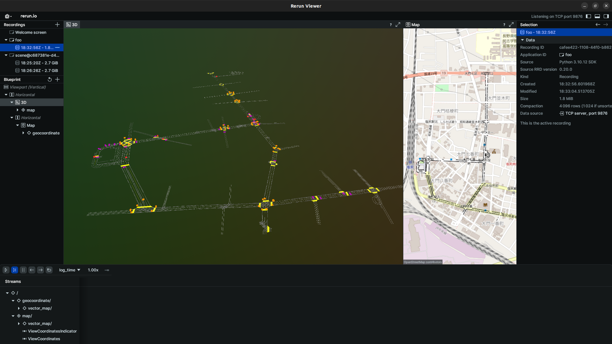

## Rendering with `Tier4`

If you want to visualize annotation results, `Tier4` supports some rendering methods as below.

### Scene

```python
>>> t4.render_scene()
```


### Specific Instance(s)

```python
>>> instance_token = t4.instance[0].token
>>> t4.render_instance(instance_token)
```


<!-- prettier-ignore-start -->
!!! NOTE
    You can also render multiple instances at once:

    <!-- markdownlint-disable MD046 -->
    ```python
    >>> instance_tokens = [inst.token for inst in t4.instance[:3]]
    >>> t4.render_instance(instance_tokens)
    ```
<!-- prettier-ignore-end -->

### PointCloud

```python
>>> t4.render_pointcloud()
```


<!-- prettier-ignore-start -->
!!! NOTE
    In case of you want to ignore camera distortion, please specify `ignore_distortion=True`.

    <!-- markdownlint-disable MD046 -->
    ```python
    >>> t4.render_pointcloud(ignore_distortion=True)
    ```
<!-- prettier-ignore-end -->

### Save Recording

You can save the rendering result as follows:

```python
>>> t4.render_scene(scene_token, save_dir=<DIR_TO_SAVE>)
```

When you specify `save_dir`, viewer will not be spawned on your screen.

## Rendering with `RerunViewer`

If you want to visualize your components, such as boxes that your ML-model estimated, `RerunViewer` allows you to visualize these components.
For details, please refer to the API references.

To initialize `RerunViewer`, you can use the `ViewerBuilder` class:

```python
>>> from t4_devkit.viewer import ViewerBuilder
# You need to specify `cameras` if you want to 2D spaces
>>> viewer = (
        ViewerBuilder()
        .with_spatial3d()
        .with_spatial2d(cameras=["CAM_FRONT", "CAM_BACK"])
        .with_labels({"car": 1, "pedestrian": 2})
        .build(app_id="foo")
    )

# Timestamp in seconds
>>> seconds: int | float = ...
```

### Rendering 3D boxes

```python
# Rendering 3D boxes
>>> from t4_devkit.dataclass import Box3D
>>> box3ds = [Box3D(...)...]
>>> viewer.render_box3ds(seconds, box3ds)
```

It allows you to render boxes by specifying elements of boxes directly.

```python
# Rendering 3D boxes by specifying elements of boxes directly
>>> centers = [[i, i, i] for i in range(10)]
>>> frame_id = "base_link"
>>> rotations = [[1, 0, 0, 0] for _ in range(10)]
>>> sizes = [[1, 1, 1] for _ in range(10)]
>>> class_ids = [0 for _ in range(10)]
>>> viewer.render_box3ds(seconds, frame_id, centers, rotations, sizes, class_ids)
```


### Rendering 2D boxes

For 2D spaces, you need to specify camera names in the viewer constructor, and render images by specifying camera names:

```python
>>> import numpy as np
>>> from t4_devkit.dataclass import Box2D

# Rendering an image
>>> image = np.zeros((100, 100, 3), dtype=np.uint8)
>>> viewer.render_image(seconds, "camera1", image)

# Rendering 2D boxes
>>> box2ds = [Box2D(...)...]
>>> viewer.render_box2ds(seconds, "camera1", box2ds)
```

It allows you to render boxes by specifying elements of boxes directly:

```python
# Rendering 2D boxes by specifying elements of boxes directly
>>> rois = [[0, 0, 10 * i, 10 * i] for i in range(10)]
>>> viewer.render_box2ds(seconds, "camera1", rois, class_ids)
```


### Rendering point cloud

```python
from t4_devkit.dataclass import LidarPointCloud
from t4_devkit.viewer import PointCloudColorMode
# Point cloud channel name
>>> lidar_channel = "LIDAR_TOP"
# Load point cloud from file
>>> pointcloud = LidarPointCloud.from_file(<PATH_TO_POINTCLOUD.pcd.bin>)
>>> color_mode = PointCloudColorMode.DISTANCE
>>> viewer.render_pointcloud(seconds, lidar_channel, pointcloud, color_mode)
```


### Rendering LiDAR segmentation

```python
from t4_devkit.dataclass import SegmentationPointCloud
from t4_devkit.viewer import PointCloudColorMode
# Point cloud channel name
>>> lidar_channel = "LIDAR_TOP"
# Load point cloud and label from file
>>> pointcloud = SegmentationPointCloud.from_file("<PATH_TO_POINTCLOUD.pcd.bin>", "<PATH_TO_LABEL.pcd.bin>")
>>> viewer.render_lidarseg(seconds, lidar_channel, pointcloud)
```


### Rendering lanelet map

```python
# Rendering lanelet map
>>> viewer.render_map(<PATH_TO_LANELET.osm>)
```


